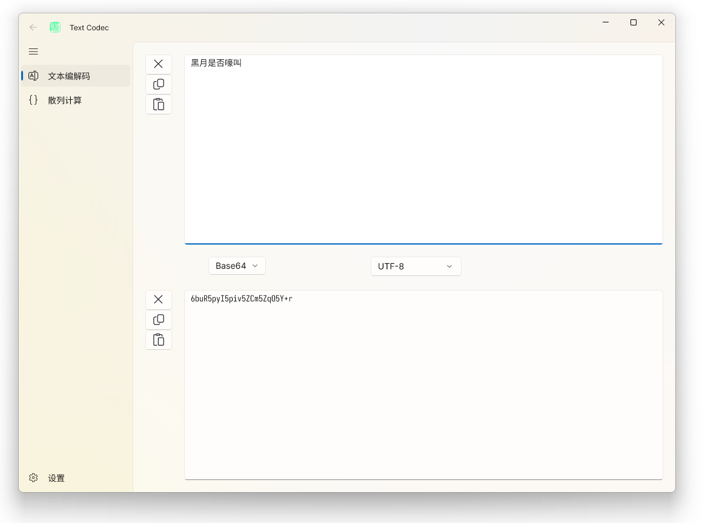

## 简介

Text Codec，一个简易文本编解码应用，编你所欲，解你所想，现已支持多种编解码算法，还支持计算文本散列，详见「[功能](#功能)」。

不同于其他的文本编解码软件，当输入的文本不是完全合法的编码文本时，Text Codec 不会直接丢弃整个文本或者不做任何处理而原样输出，而是「尽可能」尝试编解码输入文本，并挑出其中的不合法输入予以提示。此外，编解码过程是实时的，即结果会与输入同步更新，无需点击「编码」「解码」等类似按钮。

## 功能

Text Codec 预计带有以下功能：

- 文本编解码：
  - [x] Unicode 码位（二、八、十、十六进制）；
  - [x] UTF-8；
  - [x] UTF-16（大、小端序）；
  - [x] Base64；
  - [x] Base58（比特币式、标准式）；
  - [x] Base32；
  - [x] JSON 字符串；
  - [x] 国际摩尔斯电码；
  - [x] [中文电码](https://zh.wiktionary.org/wiki/Appendix:%E4%B8%AD%E6%96%87%E7%94%B5%E7%A0%81/%E4%B8%AD%E5%9B%BD%E5%A4%A7%E9%99%861983)；
  - [ ] 罗马数字转换；
  - [ ] [核心价值观](https://github.com/sym233/core-values-encoder)；
  - [ ] 兽音译者；
- 简单加密算法：
  - [x] 凯撒密码；
  - [x] 字母顺序编号；
  - [ ] 维吉尼亚密码；
- 散列计算：
  - [x] MD5；
  - [x] SHA-1；
  - [x] SHA-256；
  - [x] SHA-512。
- 乱码恢复：在 UTF-8、GBK、Shift-JIS、Big5 与 Windows-1252 之间尝试恢复乱码文字。

> 「新佛曰」和「熊曰」的作者声明二者为专有，本来想尝试支持，结果还是算了吧。

## 使用

Text Codec 的主界面大致如下图所示，上方是原始文本，下方是编码/加密后的文本，中间则是模式选择按钮和当前模式下的附加选项。

它用起来很简单，打开应用，选择你想要的编解码方式，再在上面的原始文本框或下面的编码文本框输点东西，就可以在另一个文本框得到结果了。不过，在更改模式的时候，决定原始文本不变（编码模式）还是编码文本不变（解码模式）的是最后操作的文本框，即若之前焦点落在原始文本框，那么改变的就是编码文本，反之亦然。

## 开发

本项目使用 WinUI 3（Windows App SDK 1.4）与 .NET Core 7 平台，可以下载 [Visual Studio 2022](https://visualstudio.microsoft.com/) 来构建应用。

## 已知问题

- 输入/输出文本很长的时候会有明显卡顿，甚至卡死。
  
  *这是因为 WinUI 3 文本框的性能是一坨，在加载了自定义字体后更甚。*

- 输出文本看起来少了一截。

  *当输出包含 `'\0'` 时，WinUI 文本框会舍弃它以及后面的东西。*
